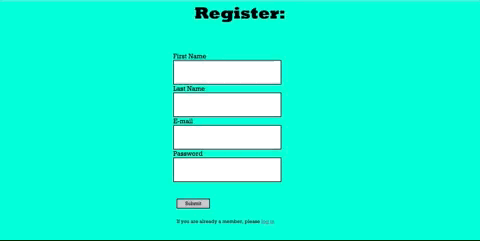
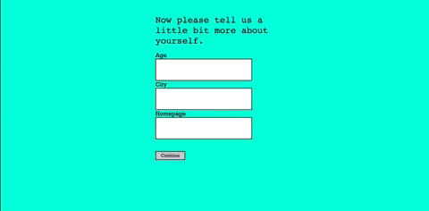
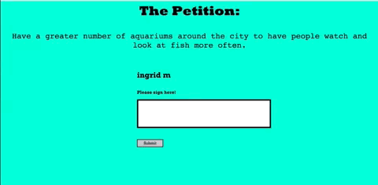
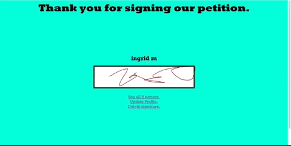
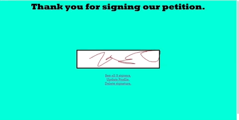
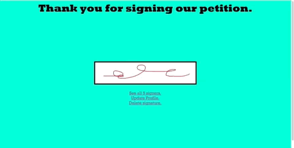

# Petition Project

## Summary:
A petition for cities to have more public aquariums to raise awareness to water-life creatures. Not only that, but to appreciate what exists under-water, similar to the feeling of scuba-diving.
## Tech Stack:
* Express.js on Node.js
* Redis
* PostgreSQL Database

## Features:

* User registration and user sign-in.

* Users have the option to provide some information about themselves.

* Users can sign using their mouse pad on the canvas provided.

* Users can see all signers of the petition and can filter the signers by city.

* Users can update information on their profile.

* Users can delete their signature and resign from the petition. However, they will no longer be able to see the list of signers.

* Logout.

